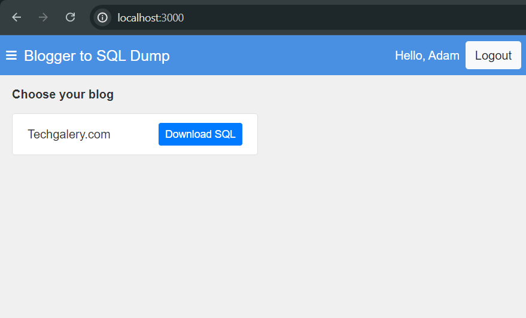

# Blogger to SQL Dump



Blogger to SQL Dump is a Node.js application that allows users to authenticate with their Google account, select one of their Blogger blogs, and export the blog posts into an SQL dump file. This tool is particularly useful for migrating content from Blogger to a database-driven platform.

## Features

- Google OAuth 2.0 authentication for secure login.
- Fetch and list all blogs associated with the authenticated user.
- Export blog posts into an SQL dump file with a single click.
- Simple and intuitive user interface.

## Technologies Used

- Node.js with Express.js
- Google OAuth 2.0 for authentication
- Blogger API for retrieving blog data
- EJS for templating
- Bootstrap for styling
- jQuery for client-side interactivity

## Prerequisites

Before you begin, ensure you have the following installed:

- [Node.js](https://nodejs.org/) (v12 or later)
- [NPM](https://www.npmjs.com/get-npm) or [Yarn](https://yarnpkg.com/)

## Getting Started

### 1. Clone the Repository

```bash
git clone [https://github.com/mudiadamz/blogger-backup-to-mysql.git](https://github.com/mudiadamz/blogger-backup-to-mysql.git)
cd blogger-to-sql-dump
```

### 2. Install Dependencies

```bash
npm install
```

### 3. Set Up Environment Variables

Create a `.env` file in the root directory of the project and add the following environment variables:

```plaintext
PORT=3000
CLIENT_ID=your-google-client-id
CLIENT_SECRET=your-google-client-secret
SESSION_SECRET=your-session-secret
```

- `PORT`: The port on which the server will run (default is 3000).
- `CLIENT_ID`: Your Google OAuth 2.0 Client ID.
- `CLIENT_SECRET`: Your Google OAuth 2.0 Client Secret.
- `SESSION_SECRET`: A secret key used to sign the session ID cookie.

### 4. Run the Application

```bash
npm start
```

The application will start on `http://localhost:3000`.

## Usage

1. Open your web browser and navigate to `http://localhost:3000`.
2. Click on the "Sign in with Google" button to authenticate.
3. Once authenticated, you will see a list of your blogs.
4. Click the "Download SQL" button next to the blog you want to export.
5. The blog posts will be exported into an SQL file and automatically downloaded to your machine.

## Error Handling

- If the application encounters an issue where the port is already in use, it will automatically attempt to start on the next available port.
- The application includes error handling for failed authentication, API errors, and other common issues.

## License

This project is licensed under the MIT License. See the [LICENSE](LICENSE) file for more details.

## Contributing

Contributions are welcome! Please fork this repository and submit a pull request if you want to contribute to this project.

## Acknowledgements

- [Google OAuth 2.0](https://developers.google.com/identity/protocols/oauth2)
- [Blogger API](https://developers.google.com/blogger/docs/3.0/getting_started)
- [Bootstrap](https://getbootstrap.com/)
- [jQuery](https://jquery.com/)
